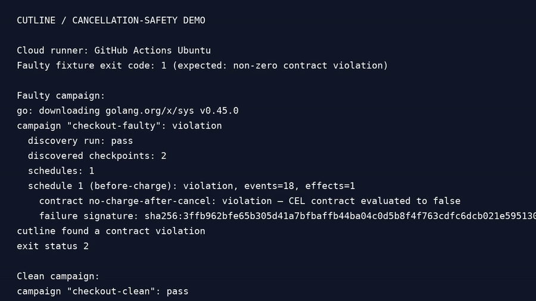

# Cutline

Cutline is a local test tool for finding work that continues after a Go context or Temporal workflow has been cancelled. It pauses an instrumented target at named checkpoints, tries a bounded set of cancellation schedules, and checks the resulting evidence against business rules.

It is useful when "the request returned cancelled" is not enough. A payment, email, retry, or background task may still have continued.

## What it does

- Controls explicitly instrumented checkpoints in Go tests.
- Records cancellation, task, and effect events in one canonical timeline.
- Evaluates CEL contracts such as "do not charge after cancellation".
- Reduces a failing schedule and writes a replayable failure capsule.
- Renders capsules as JSON or a standalone HTML report.
- Reads completed workflow history from a local Temporal server.

Cutline does not prove an arbitrary concurrent program correct. It explores only the checkpoint schedules declared by the target.

## Quick start

Cutline currently targets Go 1.26 on Linux. Build the CLI and run the included checkout fixture:

```sh
go build -o ./bin/cutline ./cmd/cutline

# Expected: exits 2 and reports no-charge-after-cancel.
./bin/cutline run --campaign test/fixtures/checkout/campaign-faulty.yaml

# Expected: exits 0.
./bin/cutline run --campaign test/fixtures/checkout/campaign-clean.yaml
```

The faulty fixture intentionally starts a charge after cancellation; the clean fixture stops before creating the effect.

## Instrumenting a Go target

Add checkpoints where cancellation timing matters, then record external side effects with a stable idempotency key and an authoritative evidence source.

```go
if err := cutline.Point(ctx, "before-charge"); err != nil {
    return err
}

effect, err := cutline.BeginEffect(ctx, cutline.EffectSpec{
    Kind:           "payment.charge",
    IdempotencyKey: orderID,
    EvidenceSource: "payment-ledger",
})
if err != nil {
    return err
}
if err := effect.Attempt(ctx); err != nil {
    return err
}

if err := gateway.Charge(ctx, orderID, amount); err != nil {
    return effect.Fail(ctx, err)
}
return effect.Commit(ctx)
```

A campaign selects the target, exploration bound, and contracts:

```yaml
apiVersion: cutline.dev/v1alpha1
kind: Campaign
name: checkout

target:
  adapter: go-test
  command: ["go", "test", "./test/fixtures/checkout", "-run", "TestCheckout"]

exploration:
  strategy: checkpoint
  maxSchedules: 200

contracts:
  - name: no-charge-after-cancel
    severity: critical
    boundary: cancellation-observed
    expression: >
      !effects.exists(e,
        e.kind == "payment.charge" &&
        e.committed &&
        e.startedAfter(cancel.observedAt))
```

## Working with failures

For a stable violation, create and replay a capsule:

```sh
cutline minimize --campaign cutline.yaml --output capsules/checkout-cancel
cutline replay capsules/checkout-cancel
cutline report capsules/checkout-cancel --format html --output report.html
```

A capsule contains the minimized release schedule, canonical events, derived effect and causal data, contract result, checksums, and redacted replay metadata. See [failure capsules](docs/failure-capsules.md) for the layout.

## Temporal

`cutline temporal inspect` reads a completed execution from a local Temporal server and converts its history to Cutline events:

```sh
cutline temporal inspect --workflow-id example --namespace default
```

The command accepts loopback endpoints only. Campaigns can also launch a local instrumented worker command per schedule; the worker receives the private Cutline control endpoint and local Temporal address through its environment. Temporal history alone still cannot prove an external dependency committed an effect; workers must provide that evidence.

## Development

```sh
make check                 # format verification, vet, unit tests, race detector
make integration           # PostgreSQL integration tests (Docker required)
make temporal-integration  # local Temporal integration test (Docker required)
make release               # complete local verification and production build
make package VERSION=v0.1.0 OUT_DIR=/tmp/cutline-v0.1.0
```

For a local PostgreSQL instance, run `docker compose up -d postgres`. The database listens on `127.0.0.1:54329`. See [releasing](docs/releasing.md) for the release checklist and Linux archive layout.

## Project status

The native Go workflow implements discovery, bounded exploration, contract evaluation, minimization, replay, and reporting. Release readiness requires the exact-commit verification gates in [releasing](docs/releasing.md), including saved-capsule replay and packaged CLI checks. PostgreSQL-backed evidence and local Temporal history ingestion are also implemented. Temporal campaigns run command-launched local workers through the same checkpoint-driven execution loop as native targets.

## Documentation

- [Getting started and project map](docs/README.md)
- [Contracts](docs/contracts.md)
- [Architecture](docs/architecture.md)
- [Failure capsules](docs/failure-capsules.md)
- [Development guide](docs/development-workflow.md)
- [Testing](docs/testing-strategy.md)
- [Releasing](docs/releasing.md)
- [Architecture decisions](docs/adr/README.md)

## License

Cutline is licensed under the [Apache License 2.0](LICENSE).

## Cloud demo

[](docs/demo/cutline-demo.mp4)

This recording is generated on a clean GitHub Actions Ubuntu runner. It executes the faulty checkout campaign, which should expose a cancellation-safety contract violation, and the clean campaign, which should pass.

To reproduce locally:

    go build -o ./bin/cutline ./cmd/cutline
    ./bin/cutline run --campaign test/fixtures/checkout/campaign-faulty.yaml
    ./bin/cutline run --campaign test/fixtures/checkout/campaign-clean.yaml

The workflow is defined in .github/workflows/demo-video.yml. The recording is a deterministic CLI demonstration, not a claim that arbitrary concurrent programs are fully verified.

The SDK drains registered descendants within the campaign's `drainTimeout`; missing terminal evidence remains inconclusive. Minimization requires a supported explicit effect witness. Valid general CEL assertions may report violations without an automatically minimizable witness; see [contracts](docs/contracts.md).
