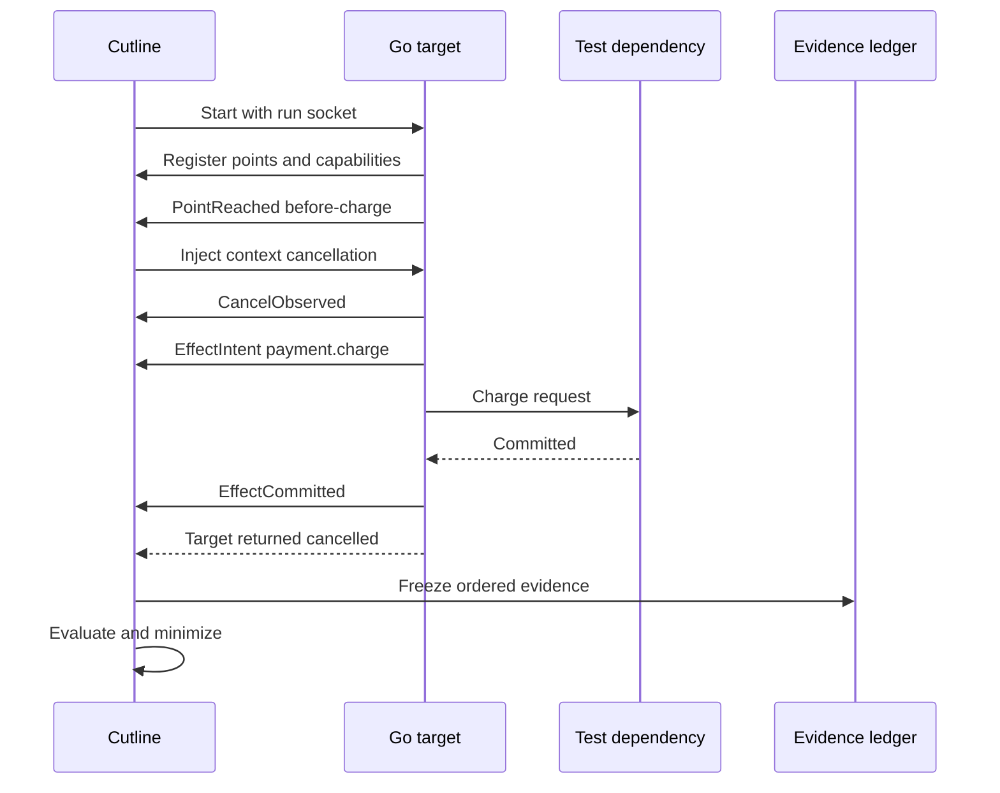
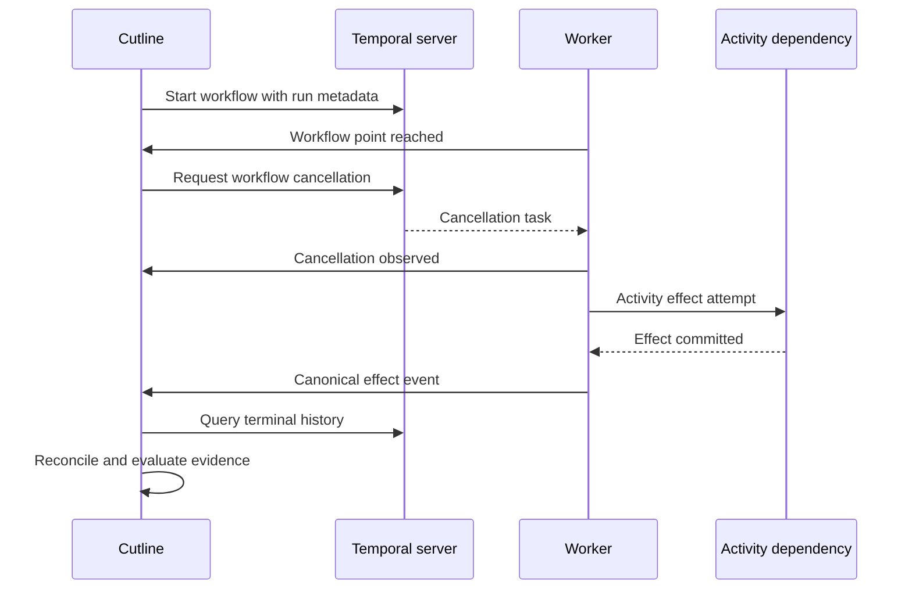
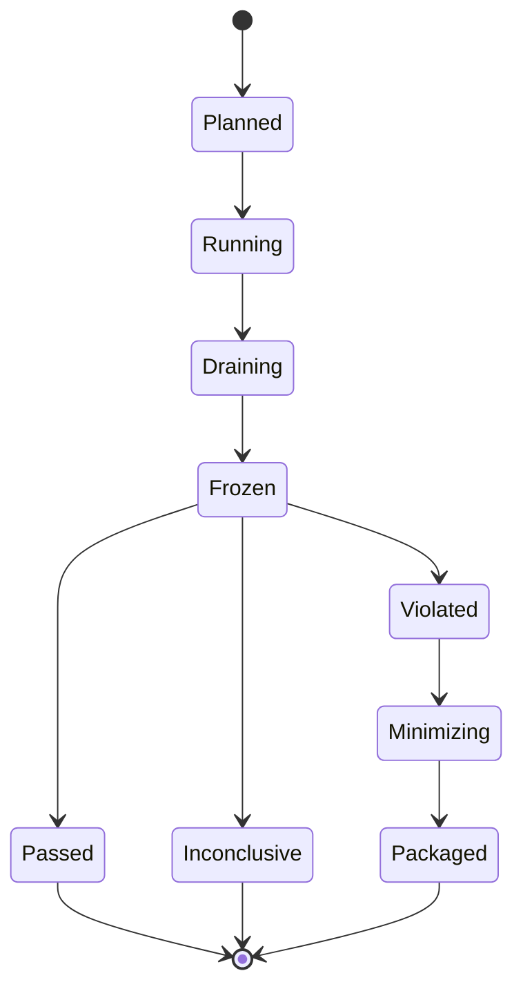

# Architecture and Execution Flows

## Package shape

Cutline starts as a modular monolith with one CLI binary and one embeddable Go
SDK.

```text
cmd/cutline/                 CLI entry point
pkg/cutline/                 public instrumentation SDK
internal/campaign/           manifest parsing and validation
internal/model/              canonical entities, events, and state machines
internal/control/            local SDK control protocol
internal/explorer/           schedule generation and search bounds
internal/scheduler/          point release and cancellation decisions
internal/ingest/             envelope validation and canonical sequencing
internal/ledger/             PostgreSQL repositories and migrations
internal/contracts/          CEL environment, helpers, and evaluation
internal/signature/          stable failure identity
internal/minimize/           candidate reduction and confirmation
internal/capsule/            packaging, validation, and replay metadata
internal/report/             static HTML and JSON renderers
internal/adapters/native/    native Go process adapter
internal/adapters/temporal/  Temporal workflow/activity adapter
internal/runtime/            process, container, and cleanup orchestration
test/fixtures/               intentionally faulty and corrected targets
```

Package APIs point inward toward `internal/model`. Runtime SDKs and
infrastructure do not leak into the canonical model.

## Native Go run



The example is a violation only when the configured rule and evidence semantics
say the committed charge crossed the prohibited boundary.

## Temporal run



Temporal history and SDK evidence are reconciled by stable workflow, run,
activity, and effect identities. Temporal determinism does not make external
activity effects exactly once.

## Explore-evaluate-minimize loop



## Dependency rules

- `pkg/cutline` must remain small and infrastructure-free.
- `internal/model` may use only the standard library.
- adapters translate into the model; the model never imports adapters.
- contract evaluation consumes frozen model views, not database rows directly.
- reports consume exported evidence models, not live target state.
- minimization invokes the same run pipeline as initial exploration.
- no package may reinterpret event ordering independently.

## Process boundaries

| Boundary | Protocol | Failure treatment |
|---|---|---|
| CLI to target SDK | Versioned local JSON envelopes over Unix socket | Disconnect makes evidence incomplete |
| Coordinator to PostgreSQL | SQL transaction | Stop schedule progression on durable-write failure |
| Coordinator to Temporal | Temporal Go SDK | Adapter classifies expected versus infrastructure failure |
| Target to fixtures | Target-specific test protocol | Effect evidence must identify authoritative source |
| Reporter to browser | Static escaped HTML/JSON | No live server or imported active content |

The JSON control protocol is an initial simplicity choice. If profiling shows
serialization overhead or compatibility pressure, changing it requires an ADR.

## Configuration boundaries

Campaign manifests express test intent. Environment-specific connection details
belong in a separate local profile or injected environment, not in committed
campaigns. A capsule resolves and records safe, redacted values needed for
replay.

## Concurrency ownership

- the scheduler is the sole writer of schedule state;
- one ingest loop assigns canonical event sequence;
- per-session local sequences detect duplication and gaps;
- contract evaluation starts only after evidence freeze;
- capsule creation reads immutable snapshots;
- cleanup is idempotent and keyed by run ID.

## Evolution

New runtimes implement the adapter capability interface. New report formats read
the capsule schema. New exploration strategies operate on canonical scheduler
state. None may fork the meaning of cancellation, effect commitment, or failure
identity.
