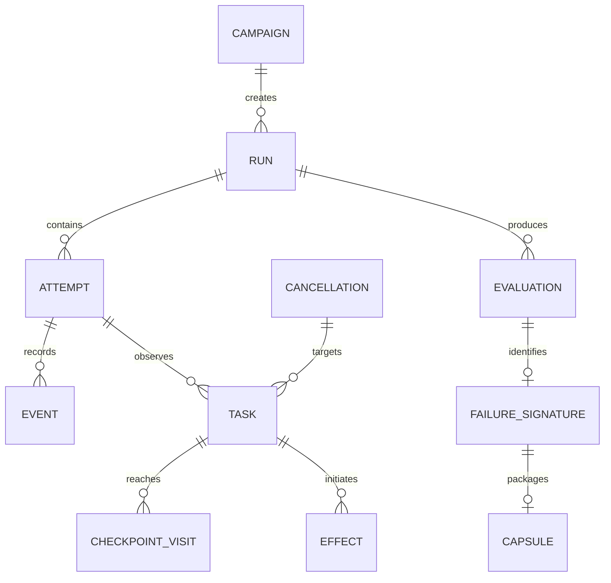

# Domain Model

## Design principles

- Separate intent, observation, and durable outcome.
- Represent unknown and incomplete states explicitly.
- Use stable identities rather than timestamps for correlation.
- Keep runtime-specific data behind adapter metadata.
- Freeze evidence before evaluation.

## Aggregate overview



## Core entities

### Campaign

Versioned declaration of target, adapter, exploration bounds, contracts,
fixtures, redaction, and output policy. A normalized campaign has a content
digest.

### Run

One logical schedule evaluation. It has a stable run ID, campaign digest, target
digest, seed, selected cancellation trigger, and lifecycle state.

### Attempt

One execution of a run or minimization candidate. Attempts prevent replay
confirmation from overwriting original evidence.

### Session

One connected target process, worker, or adapter evidence source. It owns a local
sequence and declared capabilities.

### Task

A registered unit of cancellable work:

- native goroutine or logical operation;
- Temporal workflow;
- Temporal child workflow;
- Temporal activity.

Fields include task ID, parent task ID, kind, name, runtime identity, start event,
terminal event, and terminal reason.

### Checkpoint

A stable declaration in source or workflow code. Identity combines module,
declared name, and optional static scope. A `CheckpointVisit` represents one
runtime encounter and may be blocked, released, cancelled, or abandoned.

### Cancellation

A cancellation episode with:

- trigger class;
- target entity;
- request, delivery, and observation events;
- reason;
- deadline metadata when applicable;
- propagation edges.

Repeated requests can belong to one episode but remain separate events.

### Effect

A durable or externally visible business action. Fields:

- effect ID;
- kind and schema version;
- owner task;
- idempotency key;
- intent attributes;
- evidence source;
- lifecycle;
- attempt count;
- commitment and compensation references.

Payloads are optional, bounded, and redacted. Contract logic should prefer typed
attributes over raw payload inspection.

### Resource

A lock, lease, reservation, transaction, file, connection, or other cleanup
obligation. It records acquire, renew, release, and expiration transitions.

### Schedule action

One coordinator decision: release a point, inject cancellation, advance a test
deadline, stop a target, or end drain. Actions have deterministic ordinal and
precondition digest.

### Event

An immutable canonical fact accepted by ingest. It includes canonical sequence,
session sequence, entity references, type, schema version, monotonic time,
optional wall time, and bounded attributes.

### Evaluation

Result of a built-in or user contract over a frozen evidence snapshot. Status is
`pass`, `violation`, `inconclusive`, or `invalid`.

### Failure signature

Stable normalized identity used to decide whether two attempts reproduce the
same bug.

### Capsule

Content-addressed package of a failure, evidence, minimized schedule, versions,
integrity data, and replay instructions.

## State machines

### Run

```text
created
  -> validating
  -> provisioning
  -> discovering | planned
  -> executing
  -> draining
  -> frozen
  -> passed | violated | inconclusive | invalid
  -> minimizing
  -> packaged
  -> cleaned
```

Operational failure can terminate any non-frozen phase as `incomplete`.

### Task

```text
registered -> started -> completed
                      -> cancelled
                      -> failed
                      -> lost
```

`cancelled` means task termination reports cancellation, not merely that a
cancellation request exists.

### Effect

```text
declared -> attempted -> committed -> compensated
                      -> failed
                      -> unknown
```

`unknown` is terminal for an attempt when authoritative outcome cannot be
resolved. It can never satisfy a "no effect happened" contract.

### Checkpoint visit

```text
reached -> blocked -> released
                   -> cancelled
                   -> disconnected
```

## Identity rules

- IDs are opaque and scoped to a run unless explicitly content-addressed.
- User-provided names identify declarations, not runtime visits.
- Runtime-generated IDs never appear directly in failure signatures.
- Temporal workflow/run/activity IDs are adapter metadata plus correlation keys.
- Idempotency key equality does not imply effect identity equality.

## Ordering rules

The canonical ingest sequence is an observation order, not universal causal
order. Semantic ordering uses:

1. explicit protocol acknowledgement;
2. task and effect state-machine transitions;
3. parent/child and cause edges;
4. schedule-action references;
5. adapter-authoritative history order;
6. timestamps only for presentation or bounded same-source checks.

## Versioning

Campaigns, protocol envelopes, canonical event payloads, effect kinds, CEL
environment, failure signatures, and capsules each have independent versions.
Major versions indicate incompatible semantics. Adapters declare the versions
they support.
