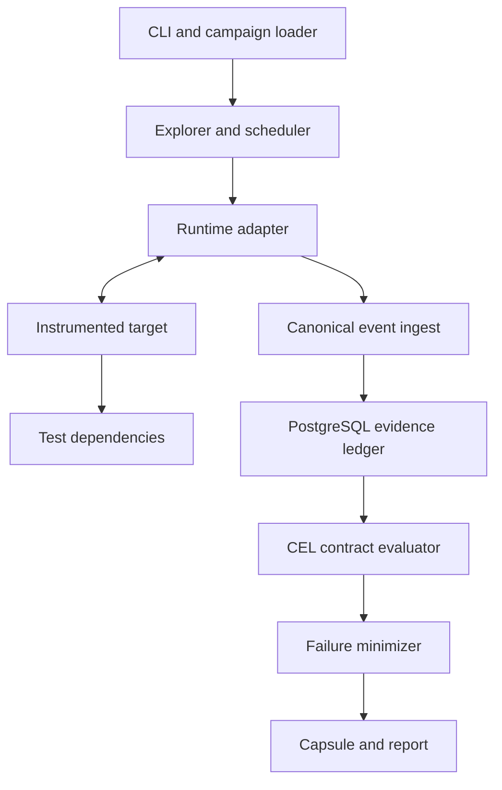

# System Design

## 1. Purpose

Cutline is a local-first test coordinator for cancellation-sensitive Go
programs. It runs a target repeatedly under controlled cancellation schedules,
collects canonical evidence, evaluates contracts, minimizes failures, and emits
replayable capsules.

The design optimizes for:

- reproducible counterexamples rather than high-volume random stress;
- business-effect correctness rather than cancellation-signal delivery alone;
- explicit evidence completeness;
- a shared model across native Go and Temporal;
- a compact implementation that can be understood by one engineer.

## 2. Correctness boundary

Cutline controls only behavior that a target exposes through its SDK or adapter.
For a given campaign, the explored universe is:

```text
declared cancellation triggers
× discovered/selected checkpoints
× bounded checkpoint release schedules
× declared target and dependency states
```

Within that universe, Cutline can produce a deterministic counterexample. It
cannot prove the absence of bugs outside the instrumentation and schedule bound.

## 3. High-level architecture



### Components

| Component | Responsibility |
|---|---|
| CLI | Validate configuration, execute runs, replay capsules, render reports |
| Campaign loader | Parse, version, normalize, and validate campaign manifests |
| Explorer | Select cancellation points and bounded release schedules |
| Scheduler | Grant checkpoint releases and inject cancellation deterministically |
| Runtime adapter | Translate native Go or Temporal behavior into canonical events |
| SDK | Declare points, tasks, effects, releases, and annotations in target code |
| Event ingest | Validate envelopes, assign canonical sequence, reject contradictions |
| Evidence ledger | Persist runs, events, effects, graph edges, evaluations, artifacts |
| Contract evaluator | Execute CEL expressions over a frozen evidence snapshot |
| Minimizer | Remove unnecessary schedule actions while preserving failure identity |
| Capsule builder | Package the smallest replayable failure and integrity manifest |
| Reporter | Produce human-readable static HTML and machine-readable JSON |

## 4. Deployment model

Version 1 runs on one Linux host:

- the Cutline coordinator runs as a local process;
- native Go fixtures run as child processes;
- Temporal, PostgreSQL, and fixture dependencies run in pinned containers;
- the SDK connects through a private Unix-domain control socket;
- the coordinator owns the test run and tears down resources;
- reports and capsules are local files.

A loopback TCP fallback may be added for environments without Unix sockets, but
remote multi-host execution is out of scope.

## 5. Canonical execution lifecycle

Each run has these phases:

1. **Validate** — parse campaign, check versions, resolve target digest, compile
   contracts, and reject unsafe endpoints.
2. **Provision** — create isolated dependencies and a clean evidence namespace.
3. **Discover** — obtain checkpoint and capability metadata without injecting
   cancellation.
4. **Plan** — choose a deterministic schedule and cancellation trigger.
5. **Execute** — start target, control releases, inject cancellation, and ingest
   events.
6. **Drain** — wait for declared child tasks and adapter-specific quiescence up
   to a fixed deadline.
7. **Freeze** — close event ingest and create an immutable evidence snapshot.
8. **Evaluate** — run completeness checks, then CEL contracts.
9. **Minimize** — if violated, reduce the schedule while preserving the failure
   signature.
10. **Package** — create capsule and reports.
11. **Cleanup** — stop containers and record cleanup outcome.

Run-state transitions are persisted. A crash can mark a run incomplete, but can
never convert it into a pass.

## 6. Control protocol

The SDK and coordinator exchange versioned messages over a local authenticated
session:

```text
Hello
RegisterPoint
PointReached
ReleasePoint
CancelInjected
CancelObserved
TaskStarted
TaskFinished
EffectIntent
EffectCommitted
EffectFailed
EffectCompensated
Annotation
TargetReturned
DrainStatus
Goodbye
```

Every envelope includes:

- protocol version;
- run ID and process session ID;
- target-local monotonically increasing sequence;
- stable entity ID;
- parent entity ID when applicable;
- monotonic timestamp and optional wall timestamp;
- payload type and schema version.

The coordinator assigns a canonical ingest sequence. Local timestamps support
diagnosis but do not define total order across processes.

### Backpressure and loss

- Control messages needed to release a checkpoint are synchronous.
- Evidence messages are acknowledged before the SDK considers them accepted.
- Buffers are bounded.
- Disconnect, overflow, invalid sequence, or unresolved acknowledgement marks
  evidence incomplete.
- An incomplete run may fail or be inconclusive; it cannot pass.

## 7. Instrumentation model

### Points

`Point(ctx, name)` declares a stable cancellation-sensitive boundary. In an
active Cutline run, it emits `PointReached` and waits for `ReleasePoint` or
cancellation according to adapter semantics. Outside Cutline, it is a low-cost
no-op plus context check.

Point names are stable public test identifiers. Dynamic high-cardinality names
are invalid.

### Tasks

`Spawn` registers a child task and its parent before execution. The returned
handle records start and terminal state. Raw unregistered goroutines may exist,
but contracts cannot assume they were observed.

### Effects

`Effect` records the lifecycle of an external or durable business action:

```text
intent -> attempted -> committed
                    -> failed
committed -> compensated
```

Commit means the authoritative test evidence says the effect became durable or
externally visible. Function return alone is not sufficient. Each effect has a
kind, stable effect ID, idempotency key where applicable, owner task, and
evidence source.

### Release

`Release` marks cleanup of a resource such as a lock, lease, reservation, or
temporary allocation. Resource acquisition and release events allow leak
contracts without interpreting arbitrary logs.

## 8. Scheduling and exploration

Cutline is not a general Go scheduler. It uses cooperative checkpoint control:

- each reached point becomes a blocked participant;
- the scheduler sees the current set of releasable participants;
- a deterministic policy chooses one release or injects cancellation;
- choices are recorded as schedule actions;
- the seed breaks documented ties only.

Version 1 strategies:

1. **single-cut** — cancel at each eligible checkpoint in discovery order;
2. **boundary-pair** — vary one release immediately before or after a cut;
3. **bounded-prefix** — enumerate release prefixes up to configured depth;
4. **seeded-priority** — prioritize schedules not yet represented by a causal
   signature.

Bounds include maximum schedules, maximum point visits, wall-clock deadline,
maximum blocked tasks, and maximum events.

State deduplication may use:

- set of blocked point identities;
- completed task/effect summaries;
- cancellation state;
- adapter state digest;
- release-prefix digest.

Hash equality is a search optimization, not a correctness proof. A collision or
coarse digest can miss schedules and must be disclosed in run metadata.

## 9. Cancellation model

The canonical model separates:

- **requested** — test coordinator decided to cancel;
- **delivered** — adapter delivered the cancellation mechanism;
- **observed** — target code or workflow observed cancellation;
- **returned** — target boundary terminated;
- **drained** — all registered work reached a terminal state or drain timed out.

Supported trigger classes:

- explicit Go context cancellation;
- deterministic test deadline expiration;
- Temporal workflow cancellation;
- Temporal activity cancellation observed through heartbeat or context;
- parent task cancellation propagated to registered children.

An adapter declares which transitions it can prove. Missing capability is
recorded and can make a contract unevaluable.

## 10. Evidence and causal graph

Canonical entities:

- campaign;
- target build;
- run and attempt;
- process/session;
- task;
- checkpoint visit;
- cancellation;
- effect;
- resource;
- schedule action;
- contract evaluation;
- failure signature;
- capsule.

Edges include:

- task spawned-by task;
- event emitted-by task;
- point visit belongs-to task;
- cancellation targets task or workflow;
- effect initiated-by task;
- effect caused-by event;
- compensation reverses effect;
- release closes resource;
- schedule action releases point;
- evaluation cites events.

The graph is derived from validated entity references and persisted explicitly
for reporting. Temporal proximity alone never creates causality.

## 11. PostgreSQL persistence

PostgreSQL is the authoritative evidence store for a run. Major tables:

```text
campaigns
target_builds
runs
run_attempts
sessions
tasks
checkpoint_visits
cancellations
effects
effect_transitions
resources
resource_transitions
events
causal_edges
schedule_actions
contract_evaluations
failure_signatures
capsules
artifacts
```

Key constraints:

- all run-owned rows include `run_id`;
- entity IDs are unique within a run;
- event ingest sequence is unique and monotonic per run attempt;
- target-local sequence is unique per session;
- effect transition order follows the canonical state machine;
- immutable evidence rows are never updated after freeze;
- artifact digests use SHA-256;
- schema and protocol versions are mandatory.

Raw target payloads are bounded and redacted before insertion.

## 12. Contract evaluation

CEL contracts run only after evidence freeze. Evaluation order:

1. schema validity;
2. adapter capability requirements;
3. evidence completeness;
4. built-in structural invariants;
5. user contracts.

Each result is one of:

- `pass`;
- `violation`;
- `inconclusive`;
- `invalid`.

Contracts receive immutable typed views such as `run`, `cancel`, `tasks`,
`effects`, `resources`, and `events`. Helper functions implement semantics such
as `happenedAfter`, `descendsFrom`, `wasCompensated`, and `outlived`.

The evaluator has fixed cost limits. Contracts cannot perform I/O or mutate
evidence.

## 13. Failure identity and minimization

A failure signature contains:

- contract ID and version;
- normalized violation class;
- primary offending entity kind and identity class;
- cancellation trigger class;
- canonical causal-path shape;
- adapter and schema major versions.

The exact run ID, timestamps, and generated entity IDs are excluded.

Minimization uses deterministic delta debugging:

1. remove schedule chunks;
2. reduce release prefix;
3. remove optional cancellation modifiers;
4. reduce target fixture input through an adapter hook when supported;
5. replay candidate;
6. retain candidate only when the same failure signature is reproduced for the
   configured confirmation count.

The minimizer has a run and time budget. A non-minimal but stable capsule is
valid; an unstable capsule is marked flaky and cannot be called minimized.

## 14. Failure capsule

A capsule is a directory or archive containing:

```text
manifest.json
campaign.yaml
schedule.json
events.jsonl
effects.json
graph.json
evaluation.json
target.json
dependencies.json
replay/README.md
checksums.sha256
report/index.html
```

Capsules are versioned, content-addressed, and validated before replay. See
[failure-capsules.md](failure-capsules.md).

## 15. Runtime adapters

The adapter interface owns runtime-specific behavior:

- capability discovery;
- target launch and cancellation delivery;
- canonical event translation;
- quiescence/drain detection;
- dependency snapshots;
- replay preparation.

The core does not import Temporal packages. Native Go and Temporal adapters
depend on the canonical core, never the reverse.

## 16. Reliability

### Coordinator crash

The run remains `incomplete`. On restart, Cutline can clean stale resources and
inspect evidence, but it does not resume midway through a schedule in version 1.

### Target crash

Crash is a terminal target event. Contracts may evaluate if evidence is complete
enough; otherwise the result is inconclusive.

### PostgreSQL interruption

The scheduler stops releasing new work, attempts cancellation, and marks the run
incomplete. Evidence is never silently buffered without a bounded acknowledgement
policy.

### Temporal interruption

The adapter records server and worker state, then classifies the run as failed or
inconclusive based on whether the interruption is part of the campaign.

### Cleanup failure

Cleanup failure is persisted separately from target correctness. It fails the
tool run operationally and is visible in the report.

## 17. Security and privacy

- local-only control plane by default;
- disposable dependencies and test credentials;
- explicit unsafe override for non-local endpoints;
- command execution without shell interpolation;
- payload allowlists, bounds, and redaction;
- escaped static reports;
- capsule archive path validation;
- no production support claim.

See [SECURITY.md](../SECURITY.md).

## 18. Observability

The coordinator emits:

- structured logs keyed by campaign, run, attempt, and schedule;
- metrics for schedules, point waits, events, incomplete runs, violations,
  minimization attempts, and replay stability;
- optional OpenTelemetry spans after the core vertical slice is stable.

Cutline's own telemetry is diagnostic. Canonical evidence remains the source of
truth for contract evaluation.

## 19. Capacity and limits

Version 1 default limits:

| Limit | Default |
|---|---:|
| Schedules per campaign | 200 |
| Events per run | 100,000 |
| Concurrent blocked tasks | 256 |
| Payload bytes per event | 64 KiB |
| Drain duration | 10 s |
| Schedule duration | 60 s |
| Minimization candidates | 500 |
| Capsule size | 100 MiB |

Defaults are provisional and must be benchmarked. Exceeding a limit produces an
explicit incomplete or inconclusive result.

## 20. Acceptance gates

The first release is not credible until:

- the checkout fixture exposes a charge-after-cancel bug;
- the same failure is reproduced from a capsule;
- minimization removes at least half of an intentionally noisy schedule;
- event loss cannot produce a pass;
- native Go and Temporal fixtures evaluate the same invariant vocabulary;
- repeated clean runs are stable;
- race tests and integration tests pass;
- reports contain no unescaped target content;
- line-budget accounting is published.
